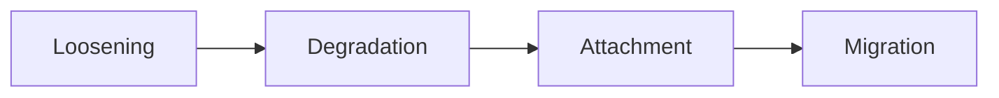

# Shorts Reader

Static reader + optional serverless backend for close-proof break reminders.
The reader itself needs zero setup — deploy and go. The push-notification
backend is opt-in and takes ~15 minutes to wire up.

## Deploy to Vercel

- **Dashboard:** drag this whole folder onto vercel.com/new, or "Import" it as a
  project — no framework preset needed, leave build command empty.
- **CLI:** `cd` into this folder, run `vercel`, accept the defaults.

Files:
```
index.html          the whole reader (HTML + CSS + JS, single file)
sw.js                service worker — local notifications + real push events
manifest.json        PWA manifest — lets it be "Added to Home Screen" with an icon
vercel.json          cache headers for the icons folder
package.json         deps for the /api functions (only needed if using the backend)
api/                 three serverless functions — the optional backend
supabase/schema.sql  one table — stores push subscriptions
.env.example          the env vars the backend needs
icons/               favicon, apple touch icon, Android/PWA icons, social preview image
```

If you skip the backend setup below entirely, the app still works exactly as
before — reminders just fall back to "while this tab stays open," same as
any local `setTimeout`. Nothing breaks; it degrades gracefully.

## Setting up close-proof break reminders (optional, ~15 min, $0)

This gets you a real notification that arrives even if you've fully closed
the browser. Three free services, no credit card anywhere.

### 1. Generate a VAPID key pair

VAPID keys are how the push service verifies the notification really came
from you. The public key is safe to expose; the private key is a secret.

```bash
npx web-push generate-vapid-keys
```

Copy the two keys it prints out. You'll use both in step 4.

### 2. Set up Supabase (skip if you already have a project — reuse it)

1. [supabase.com](https://supabase.com) → New Project (free tier).
2. Open the **SQL Editor** → paste in the contents of `supabase/schema.sql`
   from this folder → Run. That creates the one table this needs.
3. Go to **Project Settings → API** → copy the **Project URL** and the
   **`service_role` secret key** (not the `anon` key — the backend needs to
   bypass row-level security).

### 3. Set up Upstash QStash

1. [console.upstash.com](https://console.upstash.com) → sign up free.
2. Open **QStash** from the sidebar.
3. Copy the **QSTASH_TOKEN**, **QSTASH_CURRENT_SIGNING_KEY**, and
   **QSTASH_NEXT_SIGNING_KEY** shown on that page.

Free tier: 500 messages/day — a personal reminder tool will never come close.

### 4. Wire the environment variables into Vercel

Vercel project → **Settings → Environment Variables** → add each one from
`.env.example`:

```
VAPID_PUBLIC_KEY          from step 1
VAPID_PRIVATE_KEY         from step 1
VAPID_SUBJECT             mailto:you@example.com (any email, used for push service contact)
SUPABASE_URL              from step 2
SUPABASE_SERVICE_ROLE_KEY from step 2
QSTASH_TOKEN              from step 3
QSTASH_CURRENT_SIGNING_KEY  from step 3
QSTASH_NEXT_SIGNING_KEY     from step 3
APP_URL                   your deployed URL, e.g. https://shorts-reader.vercel.app (no trailing slash)
```

### 5. Paste your public key into the app

Open `index.html`, search for `VAPID_PUBLIC_KEY`, and replace the placeholder
with the **public** key from step 1 (this one's meant to be visible
client-side — it's not a secret):

```js
const VAPID_PUBLIC_KEY = 'paste-your-public-key-here';
```

### 6. Redeploy

```bash
vercel --prod
```

(or push to your connected git branch, if that's how it's wired up).

### 7. Test it

Open the deployed site, scroll to your first milestone card, hit **Set
reminder** for 1 minute, grant the notification permission prompt, then
**fully close the browser app** (swipe it away, don't just switch tabs).
A minute later you should get a system notification. If you only see the
"reminder set for while the app stays open" message instead of the
"even if you fully close the app" one, something in steps 1–5 needs a
second look — check the Vercel function logs (Project → Deployments →
Functions) for the actual error from `/api/subscribe` or
`/api/schedule-reminder`.

### What this can't do, even fully wired up

- **iOS Safari** only receives push at all if the site's been **Added to
  Home Screen** first (iOS 16.4+). A regular Safari tab can't get push,
  full stop — that's an Apple platform restriction, not something any
  backend works around.
- **Desktop browsers** need their background-running setting on (Chrome/Edge:
  "Continue running background apps when browser is closed"). Fully quitting
  the browser *process* itself pauses delivery until it's reopened.
- **Dynamic Island / a live-ticking system notification** — not reachable
  from a website on any platform. That needs native iOS ActivityKit; no
  browser exposes it to web content, wired-up backend or not.

## Session memory

The reader remembers your deck *and* your scroll position across closing and
reopening the app — both live in `localStorage`. That position sticks around
until you deliberately load a new file (drop/paste/pick another one, or hit
"load a different file" / "clear saved deck") — at that point it resets to
the top, since a new deck has no meaningful "where you left off."

## Milestones, haptics, and breaks

- Every **N** cards (set in the jump panel's settings row, default 10), a
  "relieve" card gets inserted into the scroll flow — a short breather with
  a progress note and a break-timer control. It doesn't count toward the
  deck's real card numbers (jump-to and search both skip it).
- On the same milestone, if your device supports it, you get a short double
  buzz via `navigator.vibrate()`. **Android only** — iOS Safari has never
  implemented the Vibration API, and there's no web workaround for that.
  Toggle haptics off in the same settings row.
- The break card's countdown is real-time, mirrored into the browser tab
  title so it's visible even if you switch tabs — the honest substitute for
  "ticking in a notification," which isn't something a website can do.

## Navigating a deck

Open the site, drop in a `.md`/`.txt` or `.json` deck (or paste raw text). It's
parsed entirely in your browser — nothing you load gets sent anywhere.

- **Scroll** normally to move card by card.
- Press **`/`** or tap the search icon (top-right) to open the jump panel:
  - Type a card number + **Go** to jump straight there.
  - Or type a search term — it live-searches every card's title and body,
    shows matching snippets, click one (or hit **Enter** for the top result)
    to jump to it.
  - **Esc** closes the panel.
  - Same panel also holds the milestone-frequency and haptics settings.

### Markdown deck format

```
# Deck Title

---

## SLIDE 1: Card title

Card body goes here.

---

## SLIDE 2: Next card title

...
```

### JSON deck format

```json
{
  "title": "Deck Title",
  "cards": [
    { "idx": 1, "section": "optional tag", "title": "Card title", "content": "Card body." }
  ]
}
```

## Formatting inside a card body

| Want | Syntax |
|---|---|
| Bold | `**bold**` |
| Italic | `*italic*` or `_italic_` |
| Underline | `__underline__` |
| Inline code | `` `code` `` |
| Bullet list | lines starting with `- ` |
| Numbered list | lines starting with `1. ` |
| Blockquote | lines starting with `> ` |
| Table | a header row, then `\|---\|---\|`, then data rows — standard Markdown table syntax |
| "See the textbook" reference | `{{fig: Fig 7.4}}` → renders a small chip pointing back to the source figure |
| Flowchart / diagram | a fenced ` ```mermaid ` block containing [Mermaid](https://mermaid.js.org/intro/) syntax (flowchart, sequence diagram, etc.) — rendered live |
| Raw HTML | a fenced ` ```html ` block — inserted straight through, no escaping. Handy for a table or layout that's easier to hand-write in HTML than in Markdown |

Example card mixing several of these:

````
## SLIDE 12: Invasion cascade

The four steps, in order:

1. Loosening — E-cadherin loss
2. Degrading the basement membrane
3. New attachment sites
4. Migration into the gap

{{fig: Fig 7.16}}


````

## Regenerating the icons

If you swap the app icon later, the source used here was a single 1024×1024
PNG, resized down into: `favicon-16/32/48`, `favicon.ico` (multi-size),
`apple-touch-icon` (180), `icon-192`/`icon-512` (PWA), `maskable-icon-192/512`
(Android adaptive icon, padded to ~72% so nothing gets clipped by the OS mask),
and a 1200×630 `og-image` for link previews.
